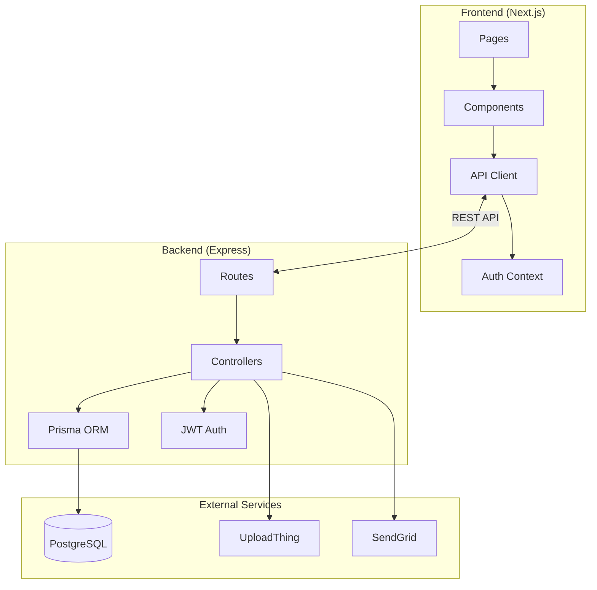

# Onboard 🚀

A modern client onboarding platform built with Next.js and Express.js. Streamline your client verification process with secure document uploads, real-time status tracking, and admin approval workflows.


## ✨ Features

### For Clients

- **Multi-step Onboarding** - Guided wizard for profile completion and document upload
- **Secure Document Upload** - Upload ID, business licenses, and tax documents via UploadThing
- **Real-time Status Tracking** - See verification status for each document
- **Email Verification** - Secure account activation via SendGrid

### For Admins

- **Admin Dashboard** - View pending documents across all clients
- **Document Preview** - View uploaded documents directly in the browser
- **Bulk Actions** - Approve all documents for a client with one click
- **Activity Log** - Audit trail of all admin actions
- **Search & Filter** - Find clients and documents quickly

### Technical Highlights

- **JWT Authentication** - Access + refresh token pattern with auto-refresh
- **Offline Detection** - Connection status banner with retry
- **Rate Limiting** - Configurable request throttling
- **Error Handling** - Retry logic with exponential backoff

---

## 🛠 Tech Stack

| Layer            | Technology                       |
| ---------------- | -------------------------------- |
| **Frontend**     | Next.js 16, React 19, TypeScript |
| **Styling**      | Tailwind CSS 4, Framer Motion    |
| **Backend**      | Express.js 5, Prisma ORM         |
| **Database**     | PostgreSQL (Supabase)            |
| **Auth**         | JWT (access + refresh tokens)    |
| **File Storage** | UploadThing                      |
| **Email**        | SendGrid                         |
| **Testing**      | Vitest, React Testing Library    |

---

## 📁 Project Structure

```
onboard/
├── frontend/               # Next.js application
│   ├── src/
│   │   ├── app/           # Pages (App Router)
│   │   ├── components/    # Reusable UI components
│   │   ├── lib/           # API client, contexts, utilities
│   │   └── __tests__/     # Test files
│   └── vitest.config.ts
│
├── backend/                # Express.js API
│   ├── src/
│   │   ├── controllers/   # Route handlers
│   │   ├── middleware/    # Auth, error handling
│   │   ├── routes/        # API routes
│   │   ├── utils/         # Email, file cleanup
│   │   └── lib/           # Prisma client
│   └── prisma/
│       └── schema.prisma  # Database schema
```

---

## � Getting Started

### Prerequisites

- Node.js 18+
- PostgreSQL database (or [Supabase](https://supabase.com) account)
- [UploadThing](https://uploadthing.com) account (for file uploads)
- [SendGrid](https://sendgrid.com) account (for emails)

### 1. Clone the repository

```bash
git clone https://github.com/your-username/onboard.git
cd onboard
```

### 2. Setup Backend

```bash
cd backend
npm install

# Copy environment variables
cp .env.example .env
# Edit .env with your values

# Run database migrations
npx prisma migrate dev

# Start development server
npm run dev
```

### 3. Setup Frontend

```bash
cd frontend
npm install

# Copy environment variables
cp .env.example .env.local
# Edit .env.local with your values

# Start development server
npm run dev
```

### 4. Create Admin User

```bash
# In backend directory
npx prisma studio
# Change a user's role from 'USER' to 'ADMIN'
```

---

## ⚙️ Environment Variables

### Backend (`backend/.env`)

| Variable                  | Description                  | Required |
| ------------------------- | ---------------------------- | -------- |
| `DATABASE_URL`            | PostgreSQL connection string | ✅       |
| `JWT_ACCESS_SECRET`       | Secret for access tokens     | ✅       |
| `JWT_REFRESH_SECRET`      | Secret for refresh tokens    | ✅       |
| `FRONTEND_URL`            | Frontend URL for CORS        | ✅       |
| `SENDGRID_API_KEY`        | SendGrid API key             | ✅       |
| `SENDGRID_FROM_EMAIL`     | Verified sender email        | ✅       |
| `UPLOADTHING_TOKEN`       | UploadThing API token        | ✅       |
| `RATE_LIMIT_MAX_REQUESTS` | Requests per window          | ❌       |

### Frontend (`frontend/.env.local`)

| Variable              | Description           | Required |
| --------------------- | --------------------- | -------- |
| `NEXT_PUBLIC_API_URL` | Backend API URL       | ✅       |
| `UPLOADTHING_TOKEN`   | UploadThing API token | ✅       |

---

## 🧪 Testing

```bash
# Frontend tests
cd frontend
npm test          # Watch mode
npm run test:run  # Single run

# Test results: 14 tests passing
```

---

## 📊 Architecture



---

## � API Endpoints

### Auth

| Method | Endpoint                | Description            |
| ------ | ----------------------- | ---------------------- |
| POST   | `/auth/signup`          | Register new user      |
| POST   | `/auth/login`           | Login user             |
| POST   | `/auth/refresh`         | Refresh access token   |
| POST   | `/auth/forgot-password` | Request password reset |
| POST   | `/auth/verify-email`    | Verify email address   |

### Profile

| Method | Endpoint   | Description              |
| ------ | ---------- | ------------------------ |
| GET    | `/profile` | Get current user profile |
| PUT    | `/profile` | Update profile           |
| DELETE | `/profile` | Delete account           |

### Documents

| Method | Endpoint         | Description           |
| ------ | ---------------- | --------------------- |
| GET    | `/documents`     | List user's documents |
| POST   | `/documents`     | Upload new document   |
| DELETE | `/documents/:id` | Delete document       |

### Admin

| Method | Endpoint                       | Description                |
| ------ | ------------------------------ | -------------------------- |
| GET    | `/admin/documents`             | List all pending documents |
| PUT    | `/admin/documents/:id/approve` | Approve document           |
| PUT    | `/admin/documents/:id/reject`  | Reject document            |
| GET    | `/admin/activity`              | View activity log          |

---

## 🚀 Deployment

### Frontend → Vercel

1. Push to GitHub
2. Import at [vercel.com](https://vercel.com)
3. Root Directory: `frontend`
4. Add env vars: `NEXT_PUBLIC_API_URL`, `UPLOADTHING_TOKEN`

### Backend → Railway

1. Push to GitHub
2. Create project at [railway.app](https://railway.app)
3. Root Directory: `backend`
4. Add all env vars from `.env.example`

### Platforms

| Platform | Frontend | Backend |
| -------- | -------- | ------- |
| Vercel   | ✅ Best  | ❌      |
| Railway  | ✅       | ✅ Best |
| Render   | ✅       | ✅      |

---

## 📝 License

MIT

---

Built with ❤️ using Next.js and Express.js
